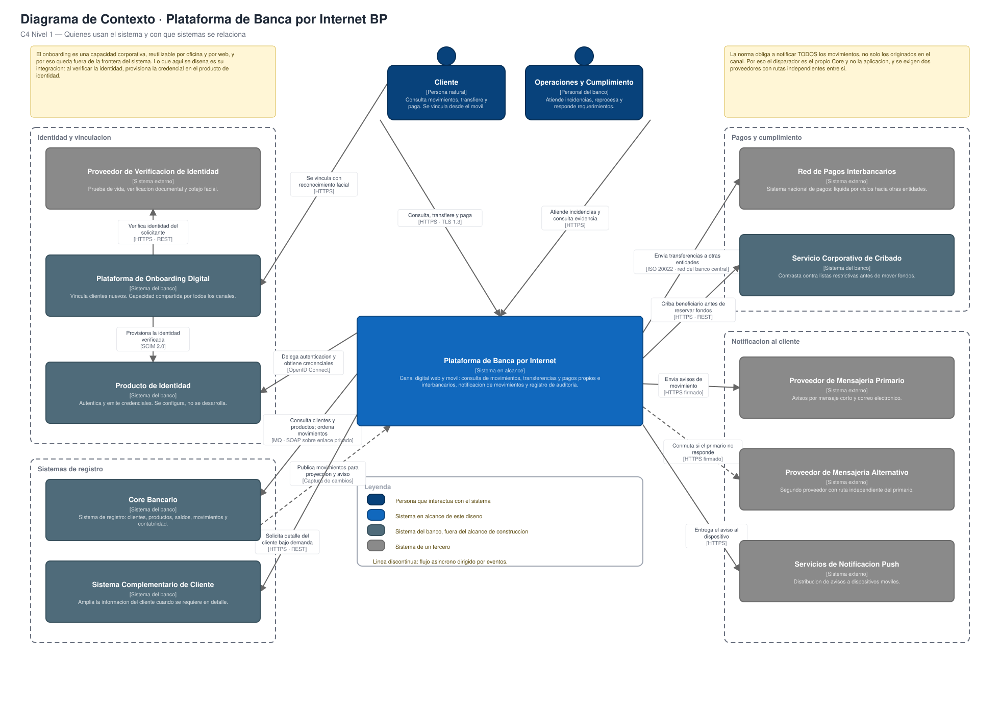

# Arquitectura de la Plataforma de Banca por Internet · BP

Diseño de la arquitectura de un canal digital —web y móvil— para la entidad financiera BP:
consulta de movimientos, transferencias y pagos propios e interbancarios, notificación de
movimientos conforme a la norma y registro auditable de la actividad del cliente.

**Autor:** Henry Cadena Herrera · **Versión 1.0** · 27 de septiembre de 2026

---

## Qué abrir

**`Arquitectura_Banca_Internet_BP.pdf`** — el documento completo, 121 páginas.
Índice navegable: cada entrada lleva al capítulo o a la sección correspondiente.

## Contenido

| | |
|---|---|
| `Arquitectura_Banca_Internet_BP.pdf` | Documento principal · 121 páginas · 18 figuras |
| `diagramas/` | Las 18 figuras en `.svg` y su **fuente editable `.drawio`** |

Los ficheros `.drawio` se abren en [diagrams.net](https://app.diagrams.net) sin instalar nada.

## Cómo está organizado el documento

| Parte | Contenido |
|---|---|
| I | Interpretación del encargo: requisitos, ambigüedades y supuestos |
| II | Contexto, drivers y 19 escenarios de calidad medibles |
| III | 52 decisiones de arquitectura, con alternativas evaluadas y justificación |
| IV | Vistas C4: contexto, contenedores y componentes |
| V | Diagramas complementarios: secuencias, despliegue, seguridad, datos, BIAN y plan |
| VI | Capítulos transversales: seguridad, normativa, disponibilidad, monitoreo y costos |
| VII | Autoevaluación, glosario y anexos |

Para una lectura rápida: **resumen ejecutivo** (página 7) y **matriz de trazabilidad**
requisito → decisión → verificación (página 113).
